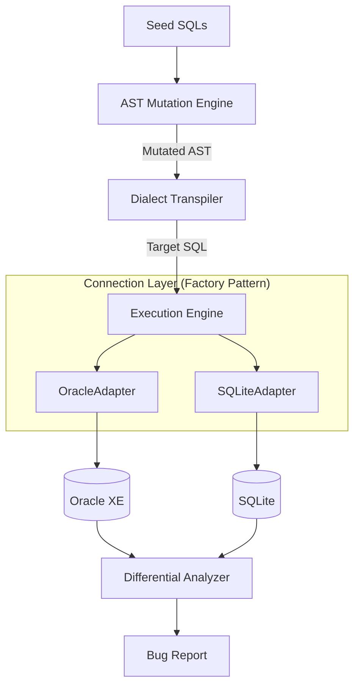

# ChimeraSQL 技术方案设计文档

## 1. 架构设计概览

ChimeraSQL 采用**分层架构（Layered Architecture）**设计，强调模块间的**低耦合（Low Coupling）**与**高内聚（High Cohesion）**。系统将“测试用例生成”、“方言转换”与“执行验证”完全解耦，通过定义清晰的接口契约进行交互。

### 系统架构图



## 2. 核心模块设计与设计模式应用

为了保证系统的可维护性和扩展性（满足毕设对工程质量的要求），本项目广泛应用了面向对象设计模式。

### 2.1 连接器模块 (Connector Module)

**设计模式:** 抽象工厂模式 (Abstract Factory) / 工厂方法模式

**设计目的:** 实现数据库连接的通用性与可替换性（响应"接口通用性"要求）。

**实现细节:**

- 定义抽象基类 DBConnector，规范 connect(), execute(), fetch() 等接口行为，模拟 JDBC 接口规范。
- 实现具体类 OracleConnector (基于 oracledb) 和 SQLiteConnector (基于 sqlite3)。
- ConnectorFactory 根据配置文件中的 db_type 自动实例化对应的连接器对象。

### 2.2 变异引擎 (Mutation Engine)

**设计模式:** 策略模式 (Strategy Pattern)

**设计目的:** 允许灵活插拔不同的模糊测试攻击策略，而无需修改核心调度逻辑。

**实现细节:**

- 定义 MutationStrategy 接口。
- 具体策略实现：
  - BoundaryInjectionStrategy: 数值边界值（INT_MAX, -1, 0）注入。
  - NullPointerStrategy: 随机将字段替换为 NULL。
  - LogicTautologyStrategy: 注入 OR 1=1 等恒真条件。
- MutatorContext 类负责接收种子 AST，并随机组合应用上述策略。

### 2.3 配置管理 (Configuration)

**设计模式:** 单例模式 (Singleton Pattern)

**设计目的:** 确保全局配置（如数据库 URL、用户名密码）在内存中仅有一份实例，避免重复读取磁盘 IO。

**实现细节:**

- ConfigLoader 类负责在系统启动时读取 config.yaml。
- 通过 Python 模块级别的单例特性或 __new__ 方法保证实例唯一性。

## 3. 关键技术实现原理

### 3.1 基于 SQLGlot 的 AST 变异

本项目不使用基于文本的正则表达式替换（易产生语法错误），而是操作 SQL 的抽象语法树（AST）。

- **解析:** sqlglot.parse_one(sql) 将 SQL 文本转换为树状对象结构。
- **遍历与修改:** 编写递归函数遍历树节点。例如，定位所有 exp.Literal.number 节点，将其值修改为边界值。
- **重组:** node.sql() 将修改后的 AST 重新序列化为 SQL 文本。

### 3.2 差分测试与结果归一化

在对比异构数据库（Oracle vs SQLite）的执行结果时，必须处理底层数据类型的差异。Analyzer 模块实现了**结果归一化（Normalization）**算法：

- **数值类型:** 将所有数值统一转换为 float 或 Decimal 进行比较，允许 1e-5 的精度误差。
- **布尔类型:** 将 Oracle 的 0/1 和 SQLite 的 True/False 统一映射为标准布尔值。
- **空值处理:** 统一处理 NULL (SQL标准) 与空字符串 '' (Oracle 特性) 的差异。

## 4. 数据库通用性接口设计 (The Universality Proof)

虽然本项目使用 Python 开发，但严格遵循了类似于 JDBC 的接口规范，以证明工具的通用性。

**接口定义 (Pseudo-code):**

```python
class DBConnector(ABC):
    @abstractmethod
    def connect(self) -> None:
        """建立数据库连接"""
        pass

    @abstractmethod
    def execute_query(self, sql: str) -> List[Tuple]:
        """执行查询并返回归一化的结果集"""
        pass

    @abstractmethod
    def close(self) -> None:
        """释放资源"""
        pass
```

任何符合 Python DB-API 2.0 标准的数据库驱动（如 pymysql, psycopg2）均可被适配到此接口中，从而实现对新数据库的支持。

## 5. 部署与环境解耦

- **配置解耦:** 所有环境相关参数（IP、端口、账号）均移出代码，存放于 config.yaml。
- **服务解耦:** 数据库服务作为外部依赖。开发环境推荐使用 Docker 运行 Oracle XE，应用层通过 TCP/IP 网络连接，不仅降低了本地环境污染，也模拟了真实的远程数据库测试场景。