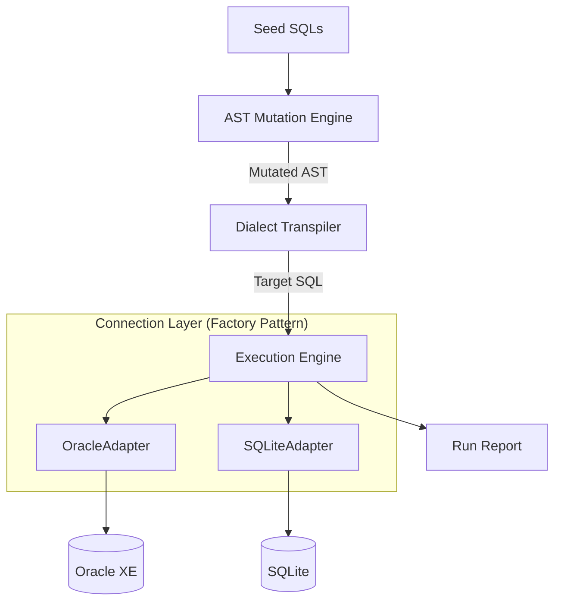

# ChimeraSQL 技术方案设计文档

## 1. 架构设计概览

ChimeraSQL 采用**分层架构（Layered Architecture）**设计，强调模块间的**低耦合（Low Coupling）**与**高内聚（High Cohesion）**。系统将“测试用例生成”、“方言转换”与“执行验证”完全解耦，通过定义清晰的接口契约进行交互。

### 系统架构图



**解耦原则**：变异引擎与方言转译器严格解耦。默认编排为“先变异、后转译”，但允许在研发早期仅运行 seeds 的基础回归测试，或将变异与转译分别独立验证。

## 2. 核心模块设计与设计模式应用

为了保证系统的可维护性和扩展性（满足毕设对工程质量的要求），本项目广泛应用了面向对象设计模式。

### 2.1 连接器模块 (Connector Module)

**设计模式:** 抽象工厂模式 (Abstract Factory) / 工厂方法模式

**设计目的:** 实现数据库连接的通用性与可替换性（响应"接口通用性"要求）。

**实现细节:**

- 定义抽象基类 DBConnector，规范 connect(), execute(), fetch() 等接口行为，模拟 JDBC 接口规范。
- 实现具体类 OracleConnector (基于 oracledb) 和 SQLiteConnector (基于 sqlite3)。
- ConnectorFactory 根据配置文件中的 db_type 自动实例化对应的连接器对象。

### 2.2 变异引擎 (Mutation Engine)

**设计模式:** 策略模式 (Strategy Pattern) + 能力画像驱动门控

**设计目的:** 允许灵活插拔不同的模糊测试变异策略，且新增数据库支持时仅需编写 YAML 配置文件，无需修改变异逻辑代码。

**泛用性架构:**

变异引擎与目标数据库严格解耦。核心思路是"变异策略声明所需能力，调度器查询画像决定是否启用"：

```
变异策略池（共享）         能力画像（per-DB）         门控调度器
┌──────────────┐     ┌──────────────────┐     ┌──────────────┐
│ boundary_inj │     │ SQLGlot 自动提取 │     │ can_apply()  │
│ null_inject  │────▶│ + YAML 手工覆盖  │────▶│ 能力 ⊇ 需求? │──▶ 生效策略
│ window_frame │     │ 150+ bool flags  │     │ 随机采样     │
│ ...          │     │ 32 种方言        │     └──────────────┘
└──────────────┘     └──────────────────┘
```

**实现架构:**

```
src/core/mutator/
├── strategy_base.py          # MutationStrategy ABC + MutationResult
├── capability.py             # CapabilityProfile（SQLGlot 提取 + YAML 覆盖）
├── gate.py                   # RuleGate.can_apply() 门控
├── engine.py                 # MutationEngine 单条 SQL 变异编排
├── strategy_registry.py      # StrategyRegistry + create_default_registry()
├── batch_runner.py           # BatchMutationRunner 批量编排
├── report.py                 # MutationReport 报告生成
└── strategies/               # 10 个通用变异策略
```

**单条 SQL 变异流程（MutationEngine.mutate_one）:**

0. **方言兼容性校验**: 批量读取种子 SQL，通过 `DialectDetector` 检测是否包含与目标方言不兼容的语法特征（如 SQLite 的 `WITH RECURSIVE` 用于 Oracle）。不兼容时列出所有问题文件并拒绝执行。
1. `sqlglot.parse_one(sql)` 解析为 AST
2. `tree.walk()` 遍历收集所有 AST 节点
3. 对每个 (策略, 节点) 组合调用 `RuleGate.can_apply()` 门控过滤
4. 从通过门控的候选中随机选取 1~3 个变异操作
5. 依次调用 `strategy.mutate(node, rng)` 执行变异，通过 `node.replace()` 在 AST 中原地替换
6. `tree.sql()` 序列化为变异后的 SQL
7. 健全性检查：`sqlglot.parse_one(result_sql)` 验证语法合法性

**能力画像分层（Capability Profile）:**

1. **自动提取层（SQLGlot）**: SQLGlot 在 Dialect/Generator/Parser 三个层级维护了 150+ 个布尔能力标志，覆盖 32 种方言。`CapabilityProfile.from_sqlglot()` 程序化提取这些标志作为能力画像基线。
2. **手工覆盖层（YAML）**: `CapabilityProfile.from_dialect_version()` 自动合并 `config.yaml` 中匹配的 profile，补充 SQLGlot 未编码的能力（版本门控、features 等）。

合并规则：手工覆盖 > 自动提取 > 默认值。

**已实现的 10 个通用变异策略（Generic，所有方言可用）:**

| 策略 ID | 目标节点 | 变异行为 |
|---------|---------|---------|
| `boundary_injection` | Literal（数字） | 替换为边界值（0/-1/MAX_INT 等，从 config.yaml 读取） |
| `null_injection` | Column, Literal | 替换为 NULL |
| `predicate_negation` | EQ/NEQ/GT/GTE/LT/LTE | 比较运算符取反（= ↔ <>, > ↔ <= 等） |
| `logic_tautology` | Where, Having | 注入 OR 1=1（恒真）或 AND 1=0（恒假） |
| `operand_swap` | EQ/GT/LT/Add/Mul | 交换左右操作数 |
| `aggregate_substitution` | Count/Sum/Avg/Min/Max | 聚合函数互换 |
| `sort_direction_flip` | Ordered | ASC ↔ DESC |
| `distinct_toggle` | Select | 切换 DISTINCT |
| `limit_variation` | Limit, Offset | 修改数值（乘 2、设为 0/1 等） |
| `union_type_variation` | Union | UNION ↔ UNION ALL |

**已实现的 3 个结构变异策略（Structural，节点类型匹配）:**

| 策略 ID | 目标节点 | 变异行为 |
|---------|---------|---------|
| `subquery_wrap` | Column, Literal | 包装在标量子查询 `(SELECT expr)` 中 |
| `join_type_switch` | Join | 在 INNER/LEFT/RIGHT/CROSS JOIN 间随机切换 |
| `cte_extraction` | Subquery（FROM 子句） | 将派生表提取为 CTE |

**已实现的 4 个方言感知策略（Dialect-Aware，能力画像门控）:**

| 策略 ID | 目标节点 | requires | 变异行为 |
|---------|---------|----------|---------|
| `decode_injection` | Case（简单 CASE） | `feature.decode` | 转为 Oracle DECODE 函数 |
| `nvl2_injection` | Coalesce（2 参数） | `feature.nvl2` | 转为 Oracle NVL2 函数 |
| `median_injection` | Avg | `feature.median` | 替换为 Oracle MEDIAN 函数 |
| `except_all_toggle` | Except | `feature.except_all` | EXCEPT ↔ EXCEPT ALL |

**变异策略分类体系:**

| 类别 | 说明 | 门控 | 状态 |
|------|------|------|------|
| Generic（通用） | 边界值注入、NULL 注入、谓词取反等 | 无（全库可用） | **已实现（10 个）** |
| Structural（结构） | 子查询包装、JOIN 类型切换、CTE 提取 | 节点类型匹配 | **已实现（3 个）** |
| Dialect-Aware（方言感知） | DECODE/NVL2/MEDIAN 注入、EXCEPT ALL | 能力画像标志 | **已实现（4 个）** |

**新增数据库工作量:**

| 场景 | 所需工作 |
|------|---------|
| SQLGlot 已支持方言 + 已有 Python driver | **零代码** — 自动提取画像即可运行 |
| 需补充版本特性或 expected errors | **仅 YAML** — 约 30 行覆盖配置 |
| 全新数据库 | 1 个 YAML 画像 + 1 个 connector 类（~50 行） + 方言检测器签名（1 行映射） |
| 需要方言转译 | 额外：转译规则类 + 规则注册 + Dialect 枚举 |

完整调研证据、业界工具对比及策略清单见 `core.md`。
配置模型详细设计（Profile + Policy + Campaign）见 `core.md`。

### 2.3 方言转译器 (Dialect Transpiler)

**设计模式:** 策略模式 (Strategy Pattern) + 规则引擎 (Rule Engine)

**设计目的:** 将任意合法 SQL 从源数据库方言转换为目标数据库方言，补充 SQLGlot 未覆盖的方言差异。

**两阶段转译管线:**

1. **方言兼容性校验**: 批量读取种子 SQL，通过 `DialectDetector` 检测是否与源方言兼容。不兼容时拒绝执行。
2. 解析 → 规则链变换 → 目标方言生成（详见下方流程图）

```
输入 SQL (字符串)
    │
    ▼
sqlglot.parse_one(sql, read=source_dialect)     ← 阶段1: AST 解析
    │
    ▼
[AST 树]
    │
    ▼
rule_1.apply(tree) → rule_2.apply(tree) → ...   ← 阶段2: 规则链变换
    │
    ▼
[变换后 AST]
    │
    ▼
tree.sql(dialect=target_dialect)                 ← 阶段3: 目标方言生成
    │
    ▼
输出 SQL (字符串)
```

**实现细节:**

- **TranspilationRule (ABC)**: 规则策略接口，定义 `name`/`description`/`apply(tree)` 契约。
- **具体规则实现:**
  - `JsonExtractToJsonValueRule`: `json_extract()` → `JSON_VALUE()`（SQLite→Oracle）
  - `JsonValueToJsonExtractRule`: `JSON_VALUE()` → `json_extract()`（Oracle→SQLite）
  - `RemoveRecursiveKeywordRule`: 移除 `WITH RECURSIVE` 的 `RECURSIVE` 关键字，同时补回递归 CTE 列名列表并强制 UNION ALL（SQLite→Oracle）
  - `AddRecursiveKeywordRule`: 通过启发式检测（UNION ALL + 自引用）为递归 CTE 添加 `RECURSIVE`（Oracle→SQLite）
  - `AddFromDualRule`: 为无 FROM 子句的标量子查询补 `FROM DUAL`，并展开 GROUP BY 中的标量子查询（SQLite→Oracle）
  - `FixAggregateStarRule`: 将 `MAX(*)/MIN(*)/SUM(*)/AVG(*)` 中的 `*` 替换为 `1`（SQLite→Oracle）
  - `ExceptToMinusRule` / `MinusToExceptRule`: EXCEPT↔MINUS 转换（可选，默认不启用，Oracle 21c 已支持 EXCEPT）
- **RuleRegistry**: 按 `(source_dialect, target_dialect)` 方向管理有序规则链，支持动态注册。
- **SQLTranspiler**: 编排器，协调解析→规则链→生成的完整流程；提供 `transpile()` 和 `transpile_batch()` 接口。

**SQLGlot 原生处理 vs 自定义规则补充:**

| 方言差异 | SQLGlot 原生 | 自定义规则 |
|----------|:---:|:---:|
| LIMIT/OFFSET → FETCH FIRST (Oracle) | ✅ | — |
| COALESCE ↔ NVL | ✅ | — |
| UPPER/LOWER/LENGTH/SUBSTR | ✅ | — |
| json_extract() → JSON_VALUE() | ❌ | ✅ |
| WITH RECURSIVE → WITH | 部分（仅移除关键字） | ✅（同时补列名列表 + 强制 UNION ALL） |
| EXCEPT ↔ MINUS | 部分 | 可选 |
| 标量子查询 FROM DUAL（ORA-00923） | ❌ | ✅ |
| GROUP BY 标量子查询展开（ORA-22818） | ❌ | ✅ |
| 递归 CTE 列名列表（ORA-32039） | ❌ | ✅ |
| 递归 CTE 强制 UNION ALL（ORA-32040） | ❌ | ✅ |
| MAX(*)/MIN(*)/SUM(*)/AVG(*)（ORA-00936） | ❌ | ✅ |

**SQLGlot 关键限制与应对:**

在 SQLite→Oracle 转译实践中，发现 SQLGlot 存在以下限制，需要自定义规则补充：

1. **CTE 列名列表丢弃**: SQLGlot 在序列化 SQLite 方言时会丢弃 CTE 的列名列表（抛出 "Named columns are not supported in table alias" 警告）。Oracle 要求递归 CTE 必须有列名列表（ORA-32039），因此 `RemoveRecursiveKeywordRule` 在移除 RECURSIVE 关键字时会从第一个 SELECT 的 expressions 中提取列名并重建 TableAlias。
2. **AST 属性命名不一致**: SQLGlot 的 FROM 子句存储在 `node.args["from_"]`（注意下划线），而非直观的 `"from"`。自定义规则需使用正确的属性键访问。
3. **聚合函数 `*` 参数位置**: `MAX(*)` 中 `*` 存储在 `node.this`（`exp.Star` 类型），而非 `node.expressions` 列表。这与 `COUNT(*)` 的存储方式一致，但需要分别处理，因为 COUNT(*) 在所有方言中合法，而 MAX(*) 等在 Oracle 中不合法。

**SQLite→Oracle 默认规则链执行顺序:**

```
JsonExtractToJsonValueRule      — JSON 函数名映射
RemoveRecursiveKeywordRule      — RECURSIVE 关键字 + CTE 列名 + UNION ALL 修复
AddFromDualRule                 — 标量子查询 FROM DUAL 补全 + GROUP BY 子查询展开
FixAggregateStarRule            — MAX(*)/MIN(*)/SUM(*)/AVG(*) → MAX(1) 等
```

规则按注册顺序依次执行，每条规则接收前一条规则的输出 AST，形成管道式处理。

**容错设计（面向模糊测试场景）:**

- 单条规则执行异常不中断转译流程，记录警告信息继续执行后续规则。
- 批量转译时单条失败返回原 SQL 并附带警告，不影响其他 SQL 的转译。

### 2.4 流水线编排器 (Pipeline Orchestrator)

**设计模式:** 门面模式 (Facade Pattern) + 编排器模式 (Orchestrator)

**设计目的:** 将变异引擎、方言转译器、数据库连接器三大组件串联为端到端流水线，用户一条命令即可完成"种子 SQL → AST 变异 → 方言转译 → 单目标数据库执行 → 分析报告"。

**实现架构:**

```
src/pipeline/
├── target.py          # TargetDatabase 定义 + 从 config.yaml 加载
├── executor.py        # TargetExecutor 单目标 SQL 执行器
└── runner.py          # CampaignRunner 流水线编排器（核心）+ CampaignReport 报告生成
```

**核心流程（CampaignRunner.run）:**

流水线采用**单目标模式**，每次运行只处理一个目标数据库。目标方言通过 `-t/--target` 参数直接指定，流水线自动从 `config.yaml` 的 `targets` 节匹配第一个方言一致的目标。

```
1. 校验输入目录、收集 .sql 种子文件
2. **方言兼容性校验**: 通过 `DialectDetector` 检测种子 SQL 是否与源方言兼容，不兼容时拒绝执行
3. 根据 target_dialect 从 config.yaml 自动匹配目标（_match_target）
4. 构建输出根目录 result/run_{timestamp}/

5. 构建目标能力画像 + 变异引擎 + 转译器
6. 尝试连接目标数据库 → 失败则标记 skipped 并返回

7. FOR EACH seed SQL:
   - engine.mutate_many(sql, seed_file, count) → List[MutationResult]
   - FOR EACH mutation:
     · 源方言 ≠ 目标方言时执行转译: transpiler.transpile(mutation.sql, source, target_dialect)
     · 源方言 = 目标方言时跳过转译（同方言回归模式）
     · 写入变异后 SQL 到 output/{target_name}/{relative}_mut{N}.sql
     · executor.execute_one(transpiled_sql, metadata)
     · 收集 SQLExecutionResult

8. 写入 execution.json（该目标全部执行记录）
9. executor.close()

10. **用户交互**: 若存在执行错误，提示用户选择是否保存结果
    - 保存: 保留输出目录，继续生成报告
    - 丢弃: 删除输出目录，直接返回

11. 生成运行报告 report.md + report.json
12. 调用分析模块生成 analysis.md + analysis.json
13. 返回 CampaignResult
```

**同方言回归模式:**

当 `-s` 和 `-t` 指定相同方言时（如 `run data/seeds -s sqlite:3.52.0 -t sqlite:3.52.0`），流水线自动跳过转译阶段，仅执行"变异 → 执行 → 分析".此模式用于验证变异引擎本身的正确性，排除转译因素的干扰.

**用户交互设计:**

执行完所有 SQL 后，若存在执行错误，流水线通过 stderr 输出错误摘要并等待用户确认：

```
  执行过程中出现 N 个错误。

  是否保存本次结果？[y/N]:
```

- 选择保存（y/yes）：保留输出目录，生成运行报告和分析报告
- 选择丢弃（n/其他）：删除整个输出目录，不生成报告
- 若无错误：直接保存并生成报告，无需询问

**容错设计:**

- 目标数据库连接失败时自动跳过该目标，不中断流水线。
- 单条 SQL 变异失败时跳过该种子，不影响后续种子。
- 转译失败时使用变异后的原始 SQL（带警告标记），继续执行。
- 单条 SQL 执行失败记录错误信息，不中断批处理。

**已对接的数据库配置（config.yaml databases 节）:**

```yaml
databases:
  oracle:
    db_type: "oracle"         # ConnectorFactory.create() 的参数
    sqlglot_dialect: "oracle" # 用于转译和变异能力画像
  sqlite:
    db_type: "sqlite"
    sqlglot_dialect: "sqlite"
```

版本号通过 CLI 参数 `-t oracle:21c` 传入，用于能力画像版本匹配。

**输出目录结构:**

```
result/run_{timestamp}/
├── {target_name}/
│   ├── {seed_category}/
│   │   ├── {seed}_mut01.sql     # 已转译（或原始）、可直接执行的 SQL
│   │   └── ...
│   └── execution.json           # 该目标全部 SQL 执行结果
├── report.md                    # 运行报告（人类可读）
├── report.json                  # 运行报告（机器可读）
├── analysis.md                  # 分析报告（多维度统计分析）
└── analysis.json                # 分析报告（机器可读）
```

### 2.5 方言兼容性检测器 (Dialect Detector)

**设计模式:** 签名匹配 (Signature Matching) + 反向排除 (Negative Exclusion)

**设计目的:** 在 `mutate`、`transpile`、`run` 三个命令执行前，自动检测种子 SQL 是否与指定方言兼容。若发现不兼容的方言特征（如 SQLite 的 `WITH RECURSIVE` 用于 Oracle），列出所有不兼容文件并拒绝执行，避免产出无效 SQL。

**核心策略 — 反向排除:**

不判断 SQL 属于哪种方言，而是检查 SQL 中是否存在目标方言**不支持的**其他方言特征。无方言特征的通用 SQL 视为兼容所有方言。检测前会剥离注释（`--`、`/* */`）和字符串字面量（`'...'`），避免其中关键字导致误报。

**API:**

```python
# 单条检测
DialectDetector.is_compatible(sql: str, dialect: str) -> bool

# 批量检测（用于 batch_runner）
DialectDetector.detect_incompatible(sql_map: Dict[str, str], dialect: str) -> List[Dict[str, str]]
```

**扩展新数据库:**

仅需在 `src/utils/dialect_detector.py` 的 `_INCOMPATIBLE` 字典中添加一行映射：

```python
_INCOMPATIBLE["newdb"] = _ORACLE_SIGNATURES + _SQLITE_SIGNATURES  # 示例
```

无需改动任何检测逻辑代码，`mutate -d newdb`、`transpile -s newdb`、`run -s newdb` 自动获得校验能力。

**校验集成点:**

| 命令 | 校验时机 | 校验方言 | 文件 |
|------|---------|---------|------|
| `mutate -d <dialect>` | 变异前 | `-d` 指定的方言 | `mutator/batch_runner.py` |
| `transpile -s <source>` | 转译前 | `-s` 指定的源方言 | `transpiler/batch_runner.py` |
| `run -s <source>` | 流水线启动前 | `-s` 指定的源方言 | `pipeline/runner.py` |

### 2.6 配置管理 (Configuration)

**设计模式:** 单例模式 (Singleton Pattern)

**设计目的:** 确保全局配置（如数据库 URL、用户名密码）在内存中仅有一份实例，避免重复读取磁盘 IO。

**实现细节:**

- ConfigLoader 类负责在系统启动时读取 config.yaml。
- 通过 Python 模块级别的单例特性或 __new__ 方法保证实例唯一性。

### 2.7 分析模块 (Analyzer Module)

**设计目的:** 对模糊测试执行结果进行多维度统计分析，生成结构化分析报告，帮助研究者快速定位问题模式和评估模糊测试质量。

**实现架构:**

```
src/analyzer/
├── __init__.py      # 导出 FuzzAnalyzer, AnalysisResult, AnalysisReport
├── analyzer.py      # FuzzAnalyzer 分析器（核心）
├── result.py        # AnalysisResult + 子数据类
└── report.py        # AnalysisReport 报告生成器
```

**分析流程:**

```
List[SQLExecutionResult]
    │
    ▼
FuzzAnalyzer.analyze(results)
    │
    ├── _analyze_errors()      → List[ErrorCategory]     错误分类统计
    ├── _analyze_strategies()  → List[StrategyStats]     变异策略效果
    ├── _analyze_transpile()   → TranspileStats          转译效果
    ├── _analyze_performance() → List[PerformanceEntry]  性能分析（Top-5）
    └── _analyze_seed_coverage()→ List[SeedCoverage]     种子覆盖
    │
    ▼
AnalysisResult
    │
    ▼
AnalysisReport.generate(output_dir, analysis, ...)
    │
    ├── analysis.md      # Markdown 报告
    └── analysis.json    # JSON 报告（含 to_dict() 序列化）
```

**分析维度:**

| 维度 | 内容 | 数据类 |
|------|------|--------|
| **执行成功率** | 成功/失败/总数/成功率/总耗时/平均耗时 | `AnalysisResult` |
| **错误分类** | 按正则模式分类（表不存在、列不存在、语法错误等），给出 Top-N 和示例 | `ErrorCategory` |
| **变异策略效果** | 各策略的触发次数、成功数、失败数、成功率 | `StrategyStats` |
| **转译效果** | 应用转译规则的 SQL 数量、各规则触发次数、转译后成功/失败率 | `TranspileStats` |
| **性能分析** | 最慢 Top-5 SQL 文件及其耗时和状态 | `PerformanceEntry` |
| **种子覆盖** | 每条种子产出的变异数、成功/失败比例 | `SeedCoverage` |

**错误分类模式（按优先级匹配）:**

| 分类 | 匹配模式（正则） |
|------|----------------|
| 表不存在 | `table.*does not exist`, `no such table`, `ORA-00942` |
| 列不存在 | `column.*does not exist`, `no such column`, `ORA-00904` |
| 语法错误 | `syntax error`, `ORA-00900`, `ORA-00933` |
| 类型不匹配 | `type mismatch`, `datatype mismatch`, `ORA-00932` |
| 唯一约束冲突 | `unique constraint`, `duplicate key`, `ORA-00001` |
| 连接错误 | `connection`, `ORA-12154`, `ORA-12514` |
| 权限不足 | `permission`, `insufficient privileges`, `ORA-01031` |
| 非空约束冲突 | `cannot be null`, `NOT NULL constraint`, `ORA-01400` |
| 函数不存在 | `no such function`, `undefined function` |
| 其他错误 | `.*`（兜底） |

**循环导入处理:**

`analyzer.py` 需要引用 `SQLExecutionResult`（定义在 `pipeline/executor.py`），而 `pipeline/runner.py` 又引用 `analyzer` 模块。通过 `typing.TYPE_CHECKING` 守卫解决：`analyzer.py` 中仅在类型注解中导入 `SQLExecutionResult`，运行时不产生实际导入。

## 3. 测试数据库初始化流水线

ChimeraSQL 采用参考 SQLancer/SQLsmith 的三阶段初始化模式，在模糊测试前建立统一的测试基础设施：

```
SchemaInitializer → DataPopulator → SeedGenerator
     (DDL)             (DML)         (种子SQL文件)
```

### 3.1 SchemaInitializer（模式初始化器）

**职责:** 在 Oracle 和 SQLite 中创建统一的 5 张测试表结构。

**核心设计:**

- 使用 `dataclass` 定义通用 schema（`TableDef`、`ColumnDef`、`ForeignKeyDef`、`IndexDef`），通过类型映射字典生成各方言 DDL，不依赖 SQLGlot 转译 DDL（避免其在 DDL 上的已知兼容性问题）。
- 类型映射：`INTEGER → NUMBER(10) (Oracle) / INTEGER (SQLite)`，`VARCHAR → VARCHAR2 (Oracle) / TEXT (SQLite)`，`DECIMAL → NUMBER (Oracle) / REAL (SQLite)`。

**测试表结构:**

| 表名 | 用途 | 行数 |
|------|------|------|
| `t_users` | 核心实体，覆盖字符串/整数/小数/时间戳/布尔 | 15 |
| `t_products` | 第二实体，支持 JOIN/GROUP BY | 15 |
| `t_orders` | 关联表(user↔product)，JOIN 测试核心 | 18 |
| `t_metrics` | 数值密集型，窗口函数专用 | 16 |
| `t_tags` | 多对多，集合操作(UNION/INTERSECT/EXCEPT)专用 | 18 |

**方言差异处理:**

- **DROP TABLE**: Oracle 不支持 `IF EXISTS`，使用 PL/SQL 匿名块捕获 -942 异常；SQLite 使用 `DROP TABLE IF EXISTS`。
- **删除顺序**: 反序删除（先子表后父表），满足外键约束。
- **SQLite 外键**: 初始化前执行 `PRAGMA foreign_keys = ON`。

### 3.2 DataPopulator（数据填充器）

**职责:** 向 5 张测试表填充覆盖各种边界条件的测试数据。

**数据设计原则（参考 SQLancer 低行数策略）:**

- 每表 15–20 行，避免笛卡尔积超时
- 覆盖：正常值、NULL、边界值（0, -1, MAX）、空字符串、负数
- 占位符映射：Oracle 使用 `:1, :2, ...`，SQLite 使用 `?, ?, ...`

### 3.3 SeedGenerator（种子生成器）

**职责:** 生成约 50 个种子 SQL 文件，分为 8 个类别，供后续 AST 变异引擎使用。

**种子类别:**

| 类别 | 数量 | 覆盖特性 |
|------|------|---------|
| `01_basic_select` | 10 | WHERE/IN/LIKE/BETWEEN/DISTINCT/ORDER BY/LIMIT |
| `02_aggregation` | 7 | COUNT/SUM/AVG/MIN/MAX/GROUP BY/HAVING |
| `03_join` | 6 | INNER/LEFT/自连接/多表JOIN/JOIN+聚合 |
| `04_subquery` | 6 | 标量子查询/IN/EXISTS/相关子查询/派生表 |
| `05_set_operations` | 4 | UNION/UNION ALL/INTERSECT/EXCEPT |
| `06_window_functions` | 6 | ROW_NUMBER/RANK/DENSE_RANK/SUM OVER/AVG OVER |
| `07_null_handling` | 6 | IS NULL/IS NOT NULL/COALESCE/聚合中NULL |
| `08_expressions` | 7 | 算术/CASE/CAST/嵌套表达式 |
| `09_recursive_self_join` | 6 | WITH RECURSIVE/自连接/层级遍历 |
| `10_string_collation` | 6 | UPPER/LOWER/LENGTH/LIKE/TRIM/SUBSTR (Unicode) |
| `11_json_handling` | 6 | json_extract/NULL处理/聚合中JSON |

**设计约束:** 每条种子带确定性 ORDER BY；避免数据库特有语法；不含 RIGHT JOIN（SQLite 兼容性）。

## 4. 命令行接口与编排层

采用 **分层 CLI 架构**，遵循 thin main 原则：

```
main.py              → 薄入口（仅 import + 调用）
  └── src/cli.py     → argparse 参数解析 + 子命令分发 + 顶层错误处理
        ├── src/core/init_pipeline.py              → init 三阶段流水线编排
        ├── src/core/mutator/batch_runner.py       → 批量变异编排
        │     └── src/core/mutator/report.py       → 变异报告生成
        ├── src/core/transpiler/batch_runner.py    → 批量转译编排
        │     └── src/core/transpiler/report.py    → 转译报告生成
        └── src/pipeline/runner.py                 → 端到端流水线编排
              ├── src/pipeline/executor.py          → 单目标执行器
              ├── src/analyzer/analyzer.py          → 多维度结果分析
              └── src/analyzer/report.py            → 分析报告生成
```

`main.py` 仅包含 `from src.cli import run` 和 `run()` 调用，所有业务逻辑和辅助函数均位于 `src/` 内。验证错误（目录不存在、不支持的方言等）由业务模块抛出 `ValueError`，CLI 层统一捕获并输出日志。

### 4.1 `init` — 初始化测试基础设施

由 `InitPipeline` 类编排，执行三阶段流水线：Schema 初始化 → 数据填充 → 种子 SQL 生成。

```bash
python main.py init
```

### 4.2 `mutate` — 批量 AST 变异

由 `BatchMutationRunner` 类编排，递归扫描输入目录下所有 `.sql` 种子文件，构建目标方言的能力画像，通过 `MutationEngine` 逐条生成多个变异版本，按原目录层级写入输出目录，并由 `MutationReport` 生成 Markdown + JSON 双格式报告。

```bash
python main.py mutate <输入目录> -d <方言:版本> [-n <数量>] [--seed <随机种子>]
```

**变异数量优先级:** CLI `-n` 参数 > `config.yaml` 中 `mutation.policies.balanced_default.max_mutations_per_seed` > 默认值 3。

**输出目录命名规则:** `result/mutate_{时间戳}_{方言}/`

**输出文件命名规则:** `{原文件名去掉.sql}_mut{序号:02d}.sql`

**报告内容:** 汇总统计（种子数/变异数/失败数）、失败详情、各种子文件的变异统计与应用策略清单。

**容错设计:** 单条 SQL 变异失败不中断批量处理；变异后自动进行语法合法性校验（`sqlglot.parse_one`），去重跳过与原始 SQL 相同的变异结果。

### 4.3 `transpile` — 批量方言转译

由 `BatchTranspileRunner` 类编排，递归扫描输入目录下所有 `.sql` 文件，通过 `SQLTranspiler` 逐条转译后按相同目录层级写入输出目录，并由 `TranspileReport` 生成 Markdown + JSON 双格式报告。

```bash
python main.py transpile <输入目录> -s <源方言:版本> -t <目标方言:版本>
```

**输出目录命名规则:** `result/{时间戳}_{源方言}_{目标方言}/`

**报告内容:** 汇总统计（总数/成功/失败/有警告）、失败详情（错误信息）、全量文件清单（状态 + 应用规则）。

**容错设计:** 单条 SQL 转译失败不中断批量处理，失败的文件写入原始 SQL + 错误注释，报告中记录失败原因。

### 4.4 `run` — 端到端模糊测试流水线

由 `CampaignRunner` 类编排，串联变异引擎、方言转译器、数据库连接器和分析模块，实现完整的端到端模糊测试流程：读取种子 SQL → AST 变异 → 方言转译（可选）→ 单目标数据库执行 → 多维度分析报告。

```bash
python main.py run <输入目录> -s <源方言:版本> -t <目标方言:版本> [-n <数量>] [--seed <随机种子>]
```

**参数说明:**

| 参数 | 必需 | 说明 |
|------|------|------|
| `<输入目录>` | 是 | 包含 .sql 种子文件的目录 |
| `-s / --source` | 是 | 种子 SQL 的方言（`sqlite` 或 `oracle`） |
| `-t / --target` | 是 | 目标 SQL 的方言（与源方言相同时跳过转译） |
| `-n / --count` | 否 | 每条种子变异数量（CLI > config > 3） |
| `--seed` | 否 | 随机种子 |

**目标匹配:** `-t` 指定方言后，流水线自动从 `config.yaml` 的 `targets` 节匹配第一个方言一致的目标数据库。无需手动指定目标名称。

**输出目录命名规则:** `result/run_{时间戳}/`

**报告内容:**
- **report.md**: 运行概览（源方言、目标方言、种子数、变异数）→ 执行汇总表格（成功/失败/跳过）→ 错误 Top-10
- **report.json**: 完整结构化运行数据
- **analysis.md**: 多维度分析报告（执行成功率、错误分类、变异策略效果、转译效果、性能 Top-5、种子覆盖）
- **analysis.json**: 完整结构化分析数据
- **execution.json** (per-target): 该目标所有 SQL 的详细执行记录

**容错设计:** 目标连接失败自动跳过（标记 skipped）；变异失败跳过该种子；转译失败使用原始 SQL；执行失败记录错误继续处理。存在执行错误时，提示用户选择是否保存结果。

**示例:**

```bash
# SQLite 种子变异后直接在 SQLite 执行（同方言回归，跳过转译）
python main.py run data/seeds -s sqlite:3.52.0 -t sqlite:3.52.0 -n 2

# SQLite 种子变异后转译为 Oracle 并执行
python main.py run data/seeds -s sqlite:3.52.0 -t oracle:21c -n 2

# 指定随机种子（可复现）
python main.py run data/seeds -s sqlite:3.52.0 -t oracle:21c -n 5 --seed 42
```

## 5. 关键技术实现原理

### 5.1 基于 SQLGlot 的 AST 变异

本项目不使用基于文本的正则表达式替换（易产生语法错误），而是操作 SQL 的抽象语法树（AST）。

- **解析:** sqlglot.parse_one(sql) 将 SQL 文本转换为树状对象结构。
- **遍历与修改:** 编写递归函数遍历树节点。例如，定位所有 exp.Literal.number 节点，将其值修改为边界值。
- **重组:** node.sql() 将修改后的 AST 重新序列化为 SQL 文本。

### 5.2 执行结果记录

端到端运行阶段将每条 SQL 在各目标数据库上的执行状态、错误信息、实际执行 SQL、规则应用记录到 `execution.json`，并汇总到 `report.md` / `report.json`，用于后续排障与回归对比。

## 6. 数据库通用性接口设计 (The Universality Proof)

虽然本项目使用 Python 开发，但严格遵循了类似于 JDBC 的接口规范，以证明工具的通用性。

**接口定义 (Pseudo-code):**

```python
class DBConnector(ABC):
    @abstractmethod
    def connect(self) -> None:
        """建立数据库连接"""
        pass

    @abstractmethod
    def execute_query(self, sql: str) -> List[Tuple]:
        """执行查询并返回结果集"""
        pass

    @abstractmethod
    def close(self) -> None:
        """释放资源"""
        pass
```

任何符合 Python DB-API 2.0 标准的数据库驱动均可被适配到此接口中，从而实现对新数据库的支持。

## 7. 部署与环境解耦

- **配置解耦:** 所有环境相关参数（IP、端口、账号）均移出代码，存放于 config.yaml。
- **服务解耦:** 数据库服务作为外部依赖。开发环境推荐使用 Docker 运行 Oracle XE，应用层通过 TCP/IP 网络连接，不仅降低了本地环境污染，也模拟了真实的远程数据库测试场景。
