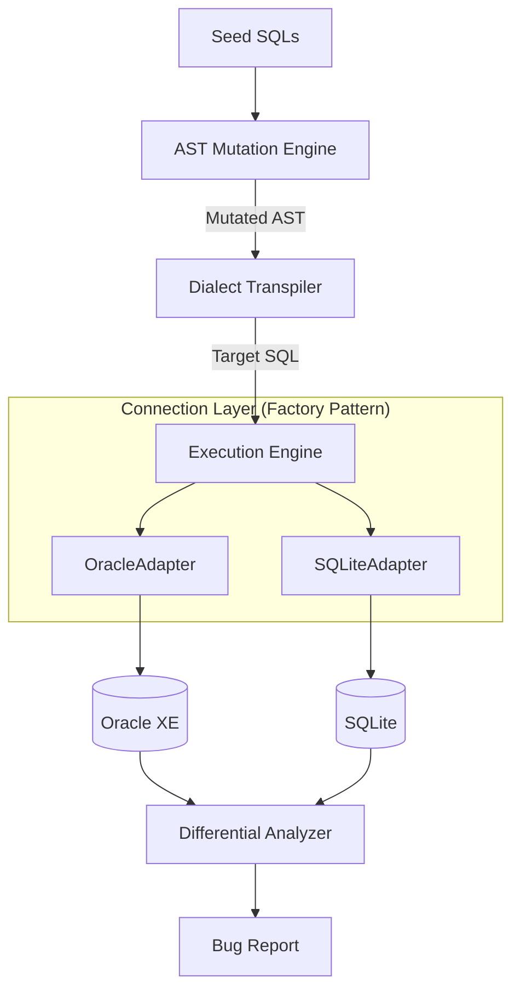

# ChimeraSQL 技术方案设计文档

## 1. 架构设计概览

ChimeraSQL 采用**分层架构（Layered Architecture）**设计，强调模块间的**低耦合（Low Coupling）**与**高内聚（High Cohesion）**。系统将“测试用例生成”、“方言转换”与“执行验证”完全解耦，通过定义清晰的接口契约进行交互。

### 系统架构图



**解耦原则**：变异引擎与方言转译器严格解耦。默认编排为“先变异、后转译”，但允许在研发早期仅运行 seeds 的基础回归测试，或将变异与转译分别独立验证。

## 2. 核心模块设计与设计模式应用

为了保证系统的可维护性和扩展性（满足毕设对工程质量的要求），本项目广泛应用了面向对象设计模式。

### 2.1 连接器模块 (Connector Module)

**设计模式:** 抽象工厂模式 (Abstract Factory) / 工厂方法模式

**设计目的:** 实现数据库连接的通用性与可替换性（响应"接口通用性"要求）。

**实现细节:**

- 定义抽象基类 DBConnector，规范 connect(), execute(), fetch() 等接口行为，模拟 JDBC 接口规范。
- 实现具体类 OracleConnector (基于 oracledb) 和 SQLiteConnector (基于 sqlite3)。
- ConnectorFactory 根据配置文件中的 db_type 自动实例化对应的连接器对象。

### 2.2 变异引擎 (Mutation Engine)

**设计模式:** 策略模式 (Strategy Pattern)

**设计目的:** 允许灵活插拔不同的模糊测试攻击策略，而无需修改核心调度逻辑。

**实现细节:**

- 定义 MutationStrategy 接口。
- 具体策略实现：
  - BoundaryInjectionStrategy: 数值边界值（INT_MAX, -1, 0）注入。
  - NullPointerStrategy: 随机将字段替换为 NULL。
  - LogicTautologyStrategy: 注入 OR 1=1 等恒真条件。
- MutatorContext 类负责接收种子 AST，并随机组合应用上述策略。

#### 2.2.1 变异规则定制化（DBMS + 版本）最佳实践

结合 SQLancer、SQLsmith、sqllogictest、SQLRight 的工程实践，变异规则不应是“一套通用策略”，而应是“能力画像驱动”的分层体系：

1. 通用规则层（Generic）
- 跨库可复用的语义扰动，如边界值、谓词变形、表达式替换。

2. DBMS 定制层（Dialect-Specific）
- 按数据库能力启停函数/语法相关规则（JSON、递归 CTE、集合操作等）。
- 仅生成目标库高概率可执行且可比较的变异 SQL。

3. 版本定制层（Version-Gated）
- 按版本开关特性规则，避免旧版本不支持语法导致无效样例激增。
- 维护 expected-errors，防止将已知版本差异误判为缺陷。

建议引入 capability profile：
- `dbms`
- `version_range`
- `features`
- `expected_errors`
- `known_differences`

变异调度流程：
- 规则候选 -> `can_apply(rule, profile)` 门控 -> 执行变异 -> 执行反馈分类（bug/expected/invalid）-> 回灌高价值样例。

该方案可显著降低误报并提高有效样例密度，符合跨数据库差分测试场景的最佳实践。
完整调研证据与来源链接见 `info/mutation_customization_research.md`。

### 2.3 方言转译器 (Dialect Transpiler)

**设计模式:** 策略模式 (Strategy Pattern) + 规则引擎 (Rule Engine)

**设计目的:** 将任意合法 SQL 从源数据库方言转换为目标数据库方言，补充 SQLGlot 未覆盖的方言差异。

**两阶段转译管线:**

```
输入 SQL (字符串)
    │
    ▼
sqlglot.parse_one(sql, read=source_dialect)     ← 阶段1: AST 解析
    │
    ▼
[AST 树]
    │
    ▼
rule_1.apply(tree) → rule_2.apply(tree) → ...   ← 阶段2: 规则链变换
    │
    ▼
[变换后 AST]
    │
    ▼
tree.sql(dialect=target_dialect)                 ← 阶段3: 目标方言生成
    │
    ▼
输出 SQL (字符串)
```

**实现细节:**

- **TranspilationRule (ABC)**: 规则策略接口，定义 `name`/`description`/`apply(tree)` 契约。
- **具体规则实现:**
  - `JsonExtractToJsonValueRule`: `json_extract()` → `JSON_VALUE()`（SQLite→Oracle）
  - `JsonValueToJsonExtractRule`: `JSON_VALUE()` → `json_extract()`（Oracle→SQLite）
  - `RemoveRecursiveKeywordRule`: 移除 `WITH RECURSIVE` 的 `RECURSIVE` 关键字（SQLite→Oracle）
  - `AddRecursiveKeywordRule`: 通过启发式检测（UNION ALL + 自引用）为递归 CTE 添加 `RECURSIVE`（Oracle→SQLite）
  - `ExceptToMinusRule` / `MinusToExceptRule`: EXCEPT↔MINUS 转换（可选，默认不启用，Oracle 21c 已支持 EXCEPT）
- **RuleRegistry**: 按 `(source_dialect, target_dialect)` 方向管理有序规则链，支持动态注册。
- **SQLTranspiler**: 编排器，协调解析→规则链→生成的完整流程；提供 `transpile()` 和 `transpile_batch()` 接口。

**SQLGlot 原生处理 vs 自定义规则补充:**

| 方言差异 | SQLGlot 原生 | 自定义规则 |
|----------|:---:|:---:|
| LIMIT/OFFSET → FETCH FIRST (Oracle) | ✅ | — |
| COALESCE ↔ NVL | ✅ | — |
| UPPER/LOWER/LENGTH/SUBSTR | ✅ | — |
| json_extract() → JSON_VALUE() | ❌ | ✅ |
| WITH RECURSIVE → WITH | ❌ | ✅ |
| EXCEPT ↔ MINUS | 部分 | 可选 |

**容错设计（面向模糊测试场景）:**

- 单条规则执行异常不中断转译流程，记录警告信息继续执行后续规则。
- 批量转译时单条失败返回原 SQL 并附带警告，不影响其他 SQL 的转译。

### 2.4 配置管理 (Configuration)

**设计模式:** 单例模式 (Singleton Pattern)

**设计目的:** 确保全局配置（如数据库 URL、用户名密码）在内存中仅有一份实例，避免重复读取磁盘 IO。

**实现细节:**

- ConfigLoader 类负责在系统启动时读取 config.yaml。
- 通过 Python 模块级别的单例特性或 __new__ 方法保证实例唯一性。

## 3. 测试数据库初始化流水线

ChimeraSQL 采用参考 SQLancer/SQLsmith 的三阶段初始化模式，在模糊测试前建立统一的测试基础设施：

```
SchemaInitializer → DataPopulator → SeedGenerator
     (DDL)             (DML)         (种子SQL文件)
```

### 3.1 SchemaInitializer（模式初始化器）

**职责:** 在 Oracle 和 SQLite 中创建统一的 5 张测试表结构。

**核心设计:**

- 使用 `dataclass` 定义通用 schema（`TableDef`、`ColumnDef`、`ForeignKeyDef`、`IndexDef`），通过类型映射字典生成各方言 DDL，不依赖 SQLGlot 转译 DDL（避免其在 DDL 上的已知兼容性问题）。
- 类型映射：`INTEGER → NUMBER(10) (Oracle) / INTEGER (SQLite)`，`VARCHAR → VARCHAR2 (Oracle) / TEXT (SQLite)`，`DECIMAL → NUMBER (Oracle) / REAL (SQLite)`。

**测试表结构:**

| 表名 | 用途 | 行数 |
|------|------|------|
| `t_users` | 核心实体，覆盖字符串/整数/小数/时间戳/布尔 | 15 |
| `t_products` | 第二实体，支持 JOIN/GROUP BY | 15 |
| `t_orders` | 关联表(user↔product)，JOIN 测试核心 | 18 |
| `t_metrics` | 数值密集型，窗口函数专用 | 16 |
| `t_tags` | 多对多，集合操作(UNION/INTERSECT/EXCEPT)专用 | 18 |

**方言差异处理:**

- **DROP TABLE**: Oracle 不支持 `IF EXISTS`，使用 PL/SQL 匿名块捕获 -942 异常；SQLite 使用 `DROP TABLE IF EXISTS`。
- **删除顺序**: 反序删除（先子表后父表），满足外键约束。
- **SQLite 外键**: 初始化前执行 `PRAGMA foreign_keys = ON`。

### 3.2 DataPopulator（数据填充器）

**职责:** 向 5 张测试表填充覆盖各种边界条件的测试数据。

**数据设计原则（参考 SQLancer 低行数策略）:**

- 每表 15–20 行，避免笛卡尔积超时
- 覆盖：正常值、NULL、边界值（0, -1, MAX）、空字符串（Oracle 视 `''` 为 NULL 的差分测试关键点）、负数
- 占位符映射：Oracle 使用 `:1, :2, ...`，SQLite 使用 `?, ?, ...`

### 3.3 SeedGenerator（种子生成器）

**职责:** 生成约 50 个种子 SQL 文件，分为 8 个类别，供后续 AST 变异引擎使用。

**种子类别:**

| 类别 | 数量 | 覆盖特性 |
|------|------|---------|
| `01_basic_select` | 10 | WHERE/IN/LIKE/BETWEEN/DISTINCT/ORDER BY/LIMIT |
| `02_aggregation` | 7 | COUNT/SUM/AVG/MIN/MAX/GROUP BY/HAVING |
| `03_join` | 6 | INNER/LEFT/自连接/多表JOIN/JOIN+聚合 |
| `04_subquery` | 6 | 标量子查询/IN/EXISTS/相关子查询/派生表 |
| `05_set_operations` | 4 | UNION/UNION ALL/INTERSECT/EXCEPT |
| `06_window_functions` | 6 | ROW_NUMBER/RANK/DENSE_RANK/SUM OVER/AVG OVER |
| `07_null_handling` | 6 | IS NULL/IS NOT NULL/COALESCE/聚合中NULL |
| `08_expressions` | 7 | 算术/CASE/CAST/嵌套表达式 |
| `09_recursive_self_join` | 6 | WITH RECURSIVE/自连接/层级遍历 |
| `10_string_collation` | 6 | UPPER/LOWER/LENGTH/LIKE/TRIM/SUBSTR (Unicode) |
| `11_json_handling` | 6 | json_extract/NULL处理/聚合中JSON |

**设计约束:** 每条种子带确定性 ORDER BY；避免数据库特有语法；不含 RIGHT JOIN（SQLite 兼容性）。

## 4. 命令行接口与编排层

采用 **分层 CLI 架构**，遵循 thin main 原则：

```
main.py              → 薄入口（仅 import + 调用）
  └── src/cli.py     → argparse 参数解析 + 子命令分发 + 顶层错误处理
        ├── src/core/init_pipeline.py              → init 三阶段流水线编排
        └── src/core/transpiler/batch_runner.py    → 批量转译编排
              └── src/core/transpiler/report.py    → 报告生成
```

`main.py` 仅包含 `from src.cli import run` 和 `run()` 调用，所有业务逻辑和辅助函数均位于 `src/` 内。验证错误（目录不存在、同方言等）由业务模块抛出 `ValueError`，CLI 层统一捕获并输出日志。

### 4.1 `init` — 初始化测试基础设施

由 `InitPipeline` 类编排，执行三阶段流水线：Schema 初始化 → 数据填充 → 种子 SQL 生成。

```bash
python main.py init
```

### 4.2 `transpile` — 批量方言转译

由 `BatchTranspileRunner` 类编排，递归扫描输入目录下所有 `.sql` 文件，通过 `SQLTranspiler` 逐条转译后按相同目录层级写入输出目录，并由 `TranspileReport` 生成 Markdown + JSON 双格式报告。

```bash
python main.py transpile <输入目录> -s <源方言> -t <目标方言>
```

**输出目录命名规则:** `result/{时间戳}_{源方言}_{目标方言}/`

**报告内容:** 汇总统计（总数/成功/失败/有警告）、失败详情（错误信息）、全量文件清单（状态 + 应用规则）。

**容错设计:** 单条 SQL 转译失败不中断批量处理，失败的文件写入原始 SQL + 错误注释，报告中记录失败原因。

## 5. 关键技术实现原理

### 5.1 基于 SQLGlot 的 AST 变异

本项目不使用基于文本的正则表达式替换（易产生语法错误），而是操作 SQL 的抽象语法树（AST）。

- **解析:** sqlglot.parse_one(sql) 将 SQL 文本转换为树状对象结构。
- **遍历与修改:** 编写递归函数遍历树节点。例如，定位所有 exp.Literal.number 节点，将其值修改为边界值。
- **重组:** node.sql() 将修改后的 AST 重新序列化为 SQL 文本。

### 5.2 差分测试与结果归一化

在对比异构数据库（Oracle vs SQLite）的执行结果时，必须处理底层数据类型的差异。Analyzer 模块实现了**结果归一化（Normalization）**算法：

- **数值类型:** 将所有数值统一转换为 float 或 Decimal 进行比较，允许 1e-5 的精度误差。
- **布尔类型:** 将 Oracle 的 0/1 和 SQLite 的 True/False 统一映射为标准布尔值。
- **空值处理:** 统一处理 NULL (SQL标准) 与空字符串 '' (Oracle 特性) 的差异。

## 6. 数据库通用性接口设计 (The Universality Proof)

虽然本项目使用 Python 开发，但严格遵循了类似于 JDBC 的接口规范，以证明工具的通用性。

**接口定义 (Pseudo-code):**

```python
class DBConnector(ABC):
    @abstractmethod
    def connect(self) -> None:
        """建立数据库连接"""
        pass

    @abstractmethod
    def execute_query(self, sql: str) -> List[Tuple]:
        """执行查询并返回归一化的结果集"""
        pass

    @abstractmethod
    def close(self) -> None:
        """释放资源"""
        pass
```

任何符合 Python DB-API 2.0 标准的数据库驱动（如 pymysql, psycopg2）均可被适配到此接口中，从而实现对新数据库的支持。

## 7. 部署与环境解耦

- **配置解耦:** 所有环境相关参数（IP、端口、账号）均移出代码，存放于 config.yaml。
- **服务解耦:** 数据库服务作为外部依赖。开发环境推荐使用 Docker 运行 Oracle XE，应用层通过 TCP/IP 网络连接，不仅降低了本地环境污染，也模拟了真实的远程数据库测试场景。
